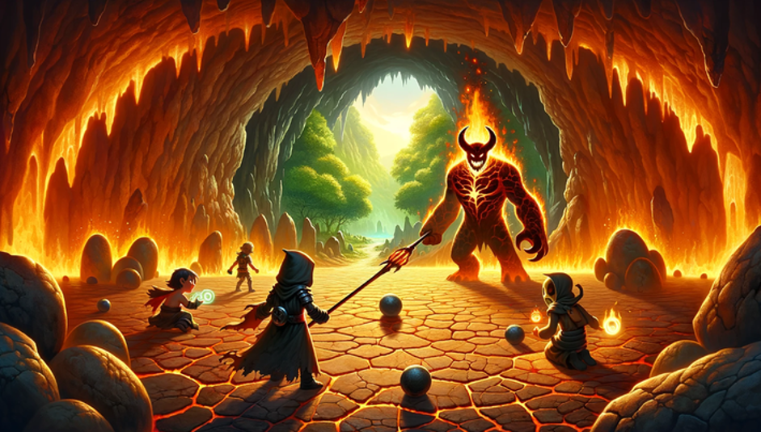
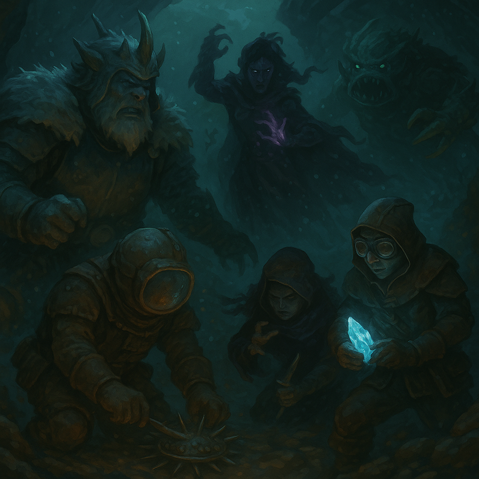

[🏠 Home](index.md) | [📖 Logbook](Logbook.md) | [👥 Party Roster](PartyRoster.md)

---

# Frosthaven Logbook

## Logbook entries

### Week 6: The Crystal Trench

The party embarked on a perilous quest upon the mayor's plea, seeking crystal shards for Frosthaven's metal supply. In the crystalline fields, ferocious wolves ambushed, setting the stage for a battle against the freezing winds.

Champion Britney Spears, with her spear and banner, stood as the party's shield, ensuring the safety of her comrades. Necro Minaj's dark arts summoned skeletal allies, a haunting force that held back the wolves as they approached the canyon.

Blinkenberg, the nimble creature, exhibited astonishing speed, swiftly eliminating the polar bears almost before the others could even engage them. The mysterious GemiNiels shape-shifted between GemiManda and GemiNiels, employing insect tactics that bewildered the lupine adversaries.

As the wolves closed in, the summoned skeletons provided a stalwart defense in the canyon, giving the party a crucial moment to regroup. The clash with the fierce polar bears tested the party's mettle, with Blinkenberg's swift actions paving the way for their victory.

Emerging from the canyon, the party stumbled upon a towering structure of crystal and metal, a breathtaking sight. This monumental discovery in the Crystal Trench sets the stage for the next chapter of their adventure, as they prepare to delve into the unknown depths of the enigmatic tower.

The tale unfolds, weaving threads of bravery and magic in the frost-laden lands of Frosthaven.

### Week 7: Sacred Soil

Blinkenblade, Seventh Week of the First Summer in the Northern Realms

Under the feeble light of the northern sun, our fellowship embarked on the Sacred Soil quest, delving deep into the mysteries of Frosthaven. Guided by the wisdom of Listeritus, the Savvas botanist, we ventured forth with purpose and determination.

Geminiels and Gemimanda, the enigmatic Harrower duo, led our charge into the frostbitten tundra, their precise strikes felling forest imps amidst the snowy expanse. Their calculated maneuvers set the stage for our expedition into the heart of the Radiant Forest.

Necro Minaj, veiled in spectral essence, summoned spectral entities to divert our adversaries' attention. Meanwhile, I, Blinkenblade, the Quatryl assassin, moved with silent grace among the shadows, striking swiftly and decisively. Together, we faced an earth demon, its demise orchestrated by the symbiotic will of Geminiels/Gemimanda, wielding the enigmatic power of "Look at me."

Amidst the chaos of battle, Necro Minaj's spectral entities wreaked havoc upon our foes with Unearthed Horror, providing crucial moments to secure our victory.

Once the enemies of the tundra lay defeated, our party divided. Britney Spear, the resilient Banner Spear, and Necro Minaj ventured toward the clear frozen lake, while I, Blinkenblade, accompanied by Geminiels and Gemimanda, pressed forward into the darkness of the dense forest.

Britney Spear's mighty blows, resonating with the rhythm of combat, secured our victory on the clear frozen lake, while Geminiels and Gemimanda swiftly gathered soil from the shadowed depths of the dense forest.

With our mission accomplished, we returned to Frosthaven, presenting our findings to Listeritus. With keen insight, the botanist confirmed the presence of the sacred oak within the soil samples. Promising further investigation, Listeritus bid us farewell, leaving us to ponder the mysteries yet concealed within the Radiant Forest.

Despite our fervent desire to delve deeper into the mysteries of the Great Oak, the path ahead remains shrouded in uncertainty, eluding our grasp for now. Thus, with hearts heavy yet brimming with anticipation, we divert our attention to the mesmerizing spectacle that awaits—the towering structure of crystal and metal, a beacon of intrigue and wonder that beckons to us from the depths of the northern wilderness.

### Week 8: Ancient Spire

The wind howled like a pack of hungry wolves as we made our way to the Crystal Spire. It stuck out from the snow like a giant's finger, pointing to the sky. Even from a distance, it looked massive, like something from an old tale.

As we stepped inside, we were hit by a wave of warm air. "Huh, it's cozy in here," Blinkenblade muttered, his small frame relaxing a bit. The place was full of moving parts and machines, nothing like the cold outside. We even saw bits of Algox among the gears and wires, which gave us all the creeps.

"We're missing Britney Spear today," Geminiels said, shifting into Gemimanda with a sigh. "She's back home, doing... I don't know, something important, I guess."

"Yeah," Necro Minaj added, her voice echoing slightly in the vast space. "It's just us against whatever's in here."

The deeper we went, the harder it got. Geminiels and Gemimanda, switching back and forth, fought side by side with Necro Minaj, who kept calling up skeletons to fight for us. "Come on, you bony loafers, get moving!" she shouted at her undead helpers, trying to keep the mood light.

Blinkenblade, meanwhile, darted ahead. "I'll take care of the big, bad boss," he declared, his voice a mix of determination and bravado. And he did. Facing that prismatic demon was like watching a dance between light and shadow, but Blinkenblade didn't falter. "You think you're tough?" he taunted the demon. "You haven't met me yet!"

With the demon gone, the machines around us just... stopped. It was quiet, too quiet. "Well, that's done," Blinkenblade said, wiping his brow. "But I've got a feeling there's more to this place."

We stood there for a moment, looking at the two paths ahead. One led deeper into the spire, and the other... who knows? "What do you think?" Geminiels asked, looking between Blinkenblade and Necro Minaj.

Necro Minaj shrugged, her gaze lingering on the silent machines. "I say we keep going. Who knows what else we'll find?"

And so, our adventure in the Crystal Spire continues, with Britney Spear waiting back in Frosthaven, unaware of the dangers and mysteries we're about to face. But one thing's for sure: whatever comes our way, we'll face it together.

### Week 9: Upper Spire

The big, scary shadow of the Crystal Spire couldn't dim the fire in our heroes' hearts. Britney Spear, back from her break and looking sharper than ever, led the way with a shiny spear in hand and determination in her eyes.

The journey took a wild turn when they jumped into a red beam, kind of like a portal, which zipped them right up to the higher floors. They landed in a small room, a bit dizzy but ready to go, with that red light keeping them company and leading the way. Waiting for them was a demon, all tentacles and rage, with a bunch of robots buzzing around it like angry bees.

Britney Spear didn't waste any time. She charged in, her spear shining bright in the dark, leading the pack against the demon and its robot pals. Necro Minaj hung back, playing it safe and smart, sending her bone buddies charging through the energy beam to fight. Her way of fighting from a distance got some side-eyes from the team, sparking a bit of a silent debate about what bravery really looks like.

The big showdown was over before they knew it. The demon put up a tough fight, but in the end, it was no match for our heroes. It vanished, leaving behind a quiet room and a bunch of switched-off robots, with that persistent beam of light still hanging around.

But the win didn't feel like a win for long. The spire seemed to wake up, the beam getting louder and stronger, like it was trying to tell them something: the biggest threat was still up top. A taunting voice floated down, all cocky and sure, talking about some unbeatable power and a master plan that was almost done. Frosthaven, and maybe even the world, was in big trouble.

Britney Spear stepped up, her spear and pet bird ready, showing the kind of leadership and care that had brought them this far. They all felt closer, bound together by the fights they'd shared and the huge fight that was still to come. Even though Necro Minaj's behind-the-lines tactics had raised a few eyebrows, they all knew they were in this together.

Climbing the iron stairs to the top of the spire, every step was loaded with the seriousness of what lay ahead. They knew the real fight, the one that could change everything for Frosthaven, was just around the corner. They'd need all the bravery, preparation, and friendship they could muster to face what was coming.

Standing at the edge of the final showdown, our heroes were ready. The challenge ahead would ask more of them than ever before. But together, they stepped forward, their spirits high and their resolve stronger than ever.

### Week 10: Top of the spire

At the top of the world, surrounded by ice spikes standing guard like ancient warriors, we faced our destiny. The air crackled with the power of the demon before us, a nightmare made flesh, its twisted form a mockery of life itself.

Britney Spear stood firm, her banner catching the wind. "This monster," she declared, "will not be our downfall."

From a safe distance, Necro Minaj danced with dark energy, her spectral army swirling around her. "Let's give them a show, my darlings," she sang out, her voice light but her eyes deadly serious.

But not all were convinced of Necro's bravery. "Standing far away doesn't mean you're not brave," she snapped back, catching their looks. "Bravery comes in many forms."

As the demon tore through their defenses, Britney's banner and her faithful bird companion were destroyed. Yet, she stood taller, her voice ringing out, "We don't need banners to show our strength!"

Blinkenblade and Geminiels/Gemimanda moved as one, their attacks a dance of death. "For our home!" they cried, their blades and spells a blur.

With a final, concerted effort, the demon's shell cracked, breaking apart under the assault. It let out a sound like the world tearing, then became nothing more than a cloud of dust, leaving behind a haunting silence.

Among the debris, a piece of pink coral pulsed with an otherworldly power. "This belongs to us now," Britney said, pocketing the strange relic.

Descending the spire, the world seemed unchanged yet entirely new. The story of our battle, a testament to our courage and unwavering spirit, would resonate within Frosthaven's walls forever.

Necro Minaj's tactics, once doubted, had saved them from the worst. Britney's loss became a reminder that what they fought for was more significant than any symbol. Blinkenblade and Geminiels/Gemimanda, through their unity, showed the strength of their bond.

As the spire shrank behind them, they carried more than the coral shard; they bore a renewed sense of purpose. The wild north, with its icy spires and desolate winds, seemed less daunting. Their hearts held a light that the darkest shadow could not dim.

And so, this chapter closes, a story of unity and defiance, a beacon for all who dare to challenge the darkness. In Frosthaven's history, their names shine bright, heroes not just of battle but of the heart.

### Retirement of Necro Minaj

In the aftermath of their harrowing ascent of the spire, the adventurers returned to Frosthaven, their spirits wearied but triumphant. Among them, Necro Minaj, once a shadowy figure dancing with the dead, chose this moment to step away from the path of danger and into a new dawn. Her retirement was not an end but a beginning, a vow to invest her might and wisdom into Frosthaven itself. Dedicating her energies to constructing a town hall, Necro Minaj sought to fortify the community that had become her home, her vast experiences in the north guiding her hand in laying down its foundations.

As one chapter closed, another opened with the arrival of Sha'Dow Kira, a mysterious figure cloaked in the aura of the Deathwalker. Stepping into the void left by Necro Minaj, Sha'Dow Kira brought a silent intensity and a deep connection to the ethereal realms. A master of manipulating the essence of life and death, Sha'Dow Kira's arrival heralded a new era for the party. With a presence as enigmatic as the night and skills honed in the unseen battles against the forces that lurk in the shadows, Sha'Dow Kira promised a strength that was both fearsome and vital.

The party, now reshaped by departure and arrival, stood at the threshold of their next great adventure. Necro Minaj, watching from the sidelines, offered a nod of approval to her successor, her legacy now entwined with the future of Frosthaven and its defenders. As Sha'Dow Kira melded into the ranks, the adventurers looked ahead to the unknown challenges that awaited, their resolve unbroken, their spirits buoyed by the fresh prowess among them. Together, they faced forward, ready to carve a new legend into the wild tapestry of the north.

### Week 11: The True Oak

As dawn's light pierced the veil of the Radiant Forest, our resolve was tested beneath the shadow of the True Oak. Liseritus' plea, a clarion call to action, echoed in our hearts as we ventured into the verdant unknown, guided by destiny and the whispers of ancient boughs.

Sha'Dow Kira, our enigmatic ally, emerged from the shadows with a fierceness that belied her journey's infancy. With swift, shadow-laced strikes, she cleaved through the zealots, her blade singing a deadly lullaby. "Witness the strength that shadows wield," she proclaimed, earning nods of respect from her comrades.

Amid the fray, Blinkenblade, our fleet-footed Quatryl, found himself ensnared by a peculiar lethargy. His usual swift dance of death slowed to a ponderous crawl, drawing sharp words from Britney Spear, "Blinkenblade, by the Great Oak, if you don't hurry up, I'll start using you as a shield!" Her jest, laced with frustration, spurred him on, a silent vow to reclaim his swiftness echoing in his heart.

Britney Spear herself stood tall amidst the clash, her spear and shield an unyielding bastion against the tide of zealotry. Despite the absence of her spectral ally, Necro Minaj, she bore the brunt of the assault with a resilience that inspired us all. "For every fallen leaf, a new hope springs," she declared, her voice a beacon amidst the chaos.

Geminiels and Gemimanda, the harrowing essence of our swarm, wove through the battle with an elegance that blurred the lines between magic and reality. Their attacks, precise and deadly, were a testament to the enigmatic power of Harrowers. "In unity, we find strength; in diversity, power," Geminiels whispered, their voice a reminder of the intricate tapestry of life.

The climax of our confrontation came with the emergence of the Flaming Sword of Justice, a zealot ablaze with misguided fervor. It was Geminiels, in a moment of serene clarity, who extinguished this flame of fanaticism, their strike a silent ode to the harmony of opposing forces.

As silence reclaimed the glade, the zealots' fervor extinguished beneath the True Oak's ancient boughs, we found solace in the forest's whispered tales of resilience. The melody of life and death, a symphony of renewal, enveloped us in its embrace.

Returning to Frosthaven, we were met by Liseritus, his embrace a warm refuge from the storm of our journey. "The Oak? Is it safe?" he asked, his voice laden with hope. Our affirmative nod, a silent testament to our vow of secrecy, bound us to the myth of the True Oak, its existence a beacon for those who seek truth amidst the shadows.

As we shared in the simple pleasure of tea, our spirits entwined by the journey that had shaped us, our dialogue a blend of relief and contemplation.

"It seems our paths are as intertwined as the roots of the True Oak itself," mused Sha'Dow Kira, her gaze lost in the flickering shadows.

"To think, Blinkenblade nearly became my shield," Britney Spear chuckled, the memory a light jest among comrades.

"Perhaps next time, I'll lead the charge," Blinkenblade retorted with a grin, his earlier slowness now a mere shadow of the past.

And so, our tale of The True Oak, a chronicle of valor, vigilance, and veiled sanctities, wove its essence into the heart of Frosthaven, a reminder of the unbreakable bonds forged in the crucible of adventure.

### Retirement of GemiNiels/GemiManda

As the chill winds whispered through the timbers of Frosthaven, carrying tales of the True Oak and the battles fought beneath its boughs, there came a day of quiet reflection and somber revelation. Geminiels/Gemimanda, the enigmatic harrower whose presence had been as baffling as it was indispensable, stood at the threshold of change. With the world around them settling into a fragile peace, they found themselves at the cusp of achieving a dream long held but scarcely spoken.

In the heart of Frosthaven, beneath the watchful gaze of the True Oak, they toiled. With hands that were not hands and wills bound by an ineffable purpose, they cultivated a sanctuary. A garden bloomed, a verdant testament to their love for all things growing, its roots intertwined with the very essence of Frosthaven. This garden, they knew, would be their legacy, a constant source of herbal bounty for those who would walk the paths they had once tread.

Yet, as the garden flourished, so too did the realization that their time amongst the denizens of Frosthaven was drawing to a close. The swarm that was Geminiels/Gemimanda felt the inexorable pull of nature's law, their numbers dwindling in the face of the relentless cold, a slow attrition that no victory in battle could forestall.

"It is both," they responded to inquiries of their waning form, their voice a symphony of unity and discord. Within their words lay a tapestry of resolve and resignation, a dual acknowledgment of their plight and their path forward. The cold of Frosthaven, while a crucible that had forged bonds and tempered spirits, was anathema to the delicate balance of their existence.

As their form shifted, revealing the duality at their core, they spoke of a new journey. "The Radiant Forest calls to us, a haven where warmth and kinship await. There, amongst our own, we may find solace and a chance to thrive." Their words, though laden with the weight of parting, carried the light of hope, a beacon guiding them to a place where the swarm might once more flourish.

In the days that followed, the inhabitants of Frosthaven bore witness to a quiet departure. Geminiels/Gemimanda, the swarm that had fought with valor and mystery beside them, embarked on a pilgrimage to the Radiant Forest. They left behind a garden, a legacy of growth and renewal, and the memories of battles fought and victories won.

Where once there was the constant hum of their presence, now there lay only silence and the occasional glimmer of a departing insect. Frosthaven, enriched by their contributions but diminished by their absence, looked on as the twilight of the swarm faded into the horizon.

And so, the saga of Geminiels/Gemimanda drew to a close, not with the clash of steel or the roar of magic, but with the gentle rustle of leaves and the promise of new beginnings in the warmth of the Radiant Forest. Their legacy, rooted in the earth of Frosthaven, would endure, a silent testament to the unity and diversity that had once walked its paths.

### Week 12: Thawed Woods

A high, nasal voice pierced the smoky gloom of The Crater, Frosthaven’s newly rebuilt canteen. "I have it, ach, I have it!" Pinter Droman, the outpost's eccentric tinkerer, pushed his way through to our usual table, eyes raw and skin waxy from lack of sleep. “The seawater, I have a way around it! Or, rather… through it! In a bathysphere!” Pinter declared, unfurling a scroll that depicted a diagram of an armored ball. His enthusiasm was palpable, even if his solution was only halfway there. The bathysphere could handle the pressure, but avoiding freezing required something more—a powerful heat source, which Pinter believed could be found in the Radiant Forest. "The whole forest is unfrozen, even in the winter, so something must be heating it!" Pinter insisted, his bleary eyes twitching. With his plan in hand, we set off to find this mysterious heat source.

The Radiant Forest was a twisted mockery of its name. Overgrown, tangled trees and knotted ivy made every step a struggle, and the odd warmth in the air only added to the surreal atmosphere. As we ventured deeper, we shed our furs to avoid overheating in the balmy oasis amidst the frozen wasteland. Suddenly, a dark blur shot toward us, razor-sharp talons slicing through the air. We barely dodged, drawing our weapons as more shapes dove at us. The assailant revealed itself—a lanky humanoid with sinewy limbs and a torso covered in flapping black wings. "Loud walkers, walking in my woods," it hissed. "A meal for sharing and new skin to wear." The birds on its body took flight, attacking us with a frenzy.

Britney Spear, always the frontline warrior, charged forward, her spear gleaming. She felled the first enemy, a Shrike Fiend, with a single mighty strike. "Bum!" she declared triumphantly. "Lisan Al Gaib," Sha'dow Kira murmured, impressed, though none of us understood the reference. Poul Krebs, our Deepwraith, attempted to confront the enemies head-on but quickly realized he was outmatched and would need to rely more on Britney’s support. "Looks like I'm not as tough as I thought," Poul muttered, fading into invisibility. "Britney, think you can handle a few more?" "Bring them on!" Britney shouted, her spear ready. "I was born for this!" Sha'dow Kira, the Deathwalker, strategically placed shadow tokens around the map, spreading her damage. Despite her arrogance, thinking herself the most crucial member, her contributions were subtle yet significant. "Don't worry, my shadows will soften them up for you," Sha'dow Kira said with a smirk, her eyes gleaming. "Maybe you should actually hit something," Blinkenblade teased, trying to hide his initial struggles. Blinkenblade, initially unfocused and stuck behind us, finally found his stride as we moved deeper into the forest.

Using the unnaturally warm air as a guide, we ventured deeper into the Radiant Forest, eventually arriving at a stone cave radiating intense heat. Inside, the temperature was unbearable, the ground cracked and scorched. Acting on a hunch, we pried up one of the scales, unleashing a burst of fire—and a flame demon. Weapons drawn, we realized the true peril of our mission: extracting the heat sources meant facing these fiery adversaries. Battling through the searing heat and relentless demons, we fought with everything we had. Sha'dow Kira placed her shadow tokens with precision, each one drawing power and striking at the demons. "Witness the strength that shadows wield," she proclaimed, her voice echoing in the cavern. Britney Spear charged forward again, her spear leading the way. "For Frosthaven!" she cried, her strikes unrelenting. Poul Krebs, now understanding his role, supported Britney, using his stealth to distract and weaken the demons. "Someone like us has to be smart about these things," he said, grinning behind his mask of invisibility. Blinkenblade, now with space to move, darted around the cavern. He revealed and collected the radiant stones we sought, his movements a blur of speed and precision. "I've got the stones!" he called out, his voice filled with triumph. "About time you did something useful," Britney teased, a wide grin on her face.

Back in the fresh air, we reveled in the cool breeze. Though fierce, the demons did not pursue us. With our stash of heat stones secure, we began the journey back to Frosthaven, eager to hand them over to Pinter and continue our quest beneath the Biting Sea.

### Week 13: Avalance

The howl of the wind was almost enough to drive them mad. It clawed at their faces, threatened to strip the skin from their bones as they clung to the narrow trail on the mountainside. With each step, their boots slipped on the icy path, but they pressed on. There was no other choice. Frosthaven’s survival depended on them reaching the peak and dealing with the Snowspeaking wretches.

Poul Krebs, moving like a shadow in the storm, nodded to his companions. “Someone like us must keep moving. No rest until we reach the top.” His voice was barely audible over the shrieking wind. The others nodded grimly, knowing that each step brought them closer to the battle ahead, but also closer to the limits of their endurance.

Britney Spear, her banner wrapped tightly around her spear, kept a determined expression on her face. “This storm won’t stop us. We’ve fought worse, haven’t we?” She tried to keep her tone light, but the truth was she was worried. This was a different kind of fight — not against monsters, but against nature itself.

Blinkenblade, his small form almost lost in the snowdrift, glanced back. “Yeah, sure, I’d take a horde of demons over this wind any day. At least they can’t freeze your blood in your veins.” He shivered, more out of frustration than cold. “Let’s just get this over with.”

Sha’dow Kira pulled her cloak tighter, her eyes scanning the white void ahead. “Eyes up. The storm is hiding something.” Her voice was soft, but it carried a weight of command that they all felt. She had faced worse than snow and wind, and her determination was a flame that would not be extinguished.

They had barely turned a corner when the peak came into view, a distant smudge of gray and white against the swirling sky. But there was something wrong. The snow seemed to shift, to swell, like a living thing. A cold dread filled them as the realization dawned. The mountain was coming down on them.

“Run!” Britney’s voice was a whip-crack in the storm. They didn’t need to be told twice. Legs pumping, hearts pounding, they sprinted back the way they came. But it was too late. The avalanche hit them like the fist of an angry god, a white wall of death that swallowed them whole.

Blinkenblade was the first to claw his way out of the suffocating snow. His breath came in ragged gasps as he looked around. They were entombed, trapped in a dark, frozen prison. Somewhere in the distance, he heard the muffled cries of his companions.

“I’m here!” he shouted, his voice bouncing off the icy walls. He dug frantically, pushing the snow aside. His hand brushed something solid, and he pulled hard, revealing Britney Spear’s face, pale but alive.

“Thanks, Blinken,” she managed, her voice hoarse. “Now let’s get the others.”

They found Poul next, his tendrils flailing weakly. “Someone like us should really consider hibernation,” he joked, his voice trembling. Despite the situation, they laughed — a brief, hysterical sound that was more relief than humor.

Sha’dow Kira appeared from a shadow nearby, as if she had been born from the darkness itself. “No time for jokes. There are creatures here. We need to move.”

The first attack came without warning — a blur of icy claws and fangs. An ice spirit lunged at them, its form almost invisible against the snow. Britney was on it in an instant, her spear slashing through its ephemeral body. “Go back to the cold, you freak!” she spat, her voice filled with venom.

Poul and Sha’dow Kira worked in tandem, shadows and mist striking at the creatures that swarmed around them. “Keep pushing forward!” Sha’dow Kira yelled. “We have to get out of this trap!”

Blinkenblade darted through the chaos, his blades flashing. He cut down one of the spirits, his movements a blur. “Hurry! I can see a way out!” His words were barely audible over the din of battle, but they spurred the others on.

Together, they fought their way through, their determination a bright flame against the biting cold. They clawed and hacked and bled their way free, emerging into the pale light of the outside world, panting and battered but alive.

They stood, gasping for breath, on the shattered mountainside. The peak was still above them, mocking in its silent, snow-covered beauty. The path they had struggled up was now a sheer cliff, impossible to scale without the proper equipment.

“This is as far as we go for now,” Britney said, her voice tight with frustration. “We need to regroup, get better gear.”

“But we’re close,” Poul murmured, his eyes on the distant peak. “Someone like us shouldn’t give up so easily.”

Sha’dow Kira placed a hand on his shoulder. “We’re not giving up. We’re just being smart.”

Blinkenblade, who had been scouting around, pointed to a dark shape half-buried in the snow. “Looks like the avalanche uncovered something. Could be worth checking out.”

They made their way over, hearts pounding with anticipation. What they found was an old, ruined structure, jutting out of the snow like a broken bone. “A temple?” Britney wondered aloud. “What’s it doing here?”

“Doesn’t matter,” Sha’dow Kira said, her eyes gleaming with determination. “We’ll find out soon enough.”

As they stared at the structure, a sense of purpose filled them. This was not the end of their journey. The storm had thrown them off course, but it had also uncovered a new path, one that could lead them to answers they hadn’t even thought to ask.

They turned back to Frosthaven, their resolve unshaken. The mountain might have defeated them today, but they would return. They were Frosthaven’s defenders, and they would not rest until their home was safe.

Together, they began the long trek back, their minds already planning the next steps. The peak could wait, but their fight was far from over.

As the group trudged down the mountain, their breath coming out in visible puffs of steam, Blinkenblade broke the silence with a casual remark. “You know, it’s good to be a solid group of four again. It was a bit lonely up in that Spire with just three of us.”

Britney Spear, walking beside him, shot him a confused glance. “What are you talking about? There were definitely four of us in the Spire. Me, you, Necro, and Geminiels.”

Blinkenblade shook his head with exaggerated dismay. “Oh no, no, no. I’m pretty sure you weren’t there. I distinctly remember you staying behind to, I don’t know, polish your shield or something.”

Britney’s eyes narrowed as she stopped dead in her tracks. “Excuse me? _Polish my shield_? I was right there in the thick of it, fighting that prismatic demon while you were zipping around like a headless chicken.”

“A headless chicken?” Blinkenblade scoffed, planting his hands on his hips. “Please, I was moving so fast you probably didn’t even see me. But you? You must have been busy adjusting your armor or fixing your hair or something.”

Britney took a step closer, pointing a gloved finger at his chest. “I was leading the charge! If it wasn’t for me, that demon would have flattened you all. I held the line while you ran around doing... whatever it is you do.”

“Saving everyone’s necks, that’s what I was doing!” Blinkenblade shot back, his voice rising. “Maybe if you’d stopped preening for a second, you would’ve noticed!”

“Preening?” Britney almost shrieked, her face flushed with anger. “You arrogant little—listen, I _am_ the shield. I took hits for everyone, while you flitted around like a snowflake in a storm, trying to be useful!”

“Oh, I was useful all right!” Blinkenblade snapped, his small frame practically vibrating with indignation. “I took down that demon’s minions faster than you could say ‘banner duty.’ Meanwhile, you were probably busy admiring your reflection in your shield.”

“You know what, Blinken?” Britney crossed her arms, her eyes blazing. “Maybe next time, I’ll just let you handle the big bad all by yourself and see how far your _flitting_ gets you.”

“Maybe you should!” Blinkenblade shot back, his voice a pitch higher. “And while you’re at it, try not to chip a nail. Wouldn’t want you to get hurt before the real fight.”

“Oh, I’ll show you real fighting, you little—” Britney stepped forward, her spear clutched tightly in her hand.

“Hey, hey, easy there!” Sha’dow Kira interjected, slipping between them with a bemused smile. “Save some of that energy for the next battle, will you?”

Poul Krebs, watching the whole exchange with an amused expression, chuckled. “Someone like us thinks you both need a nap. We’re all in this together, remember?”

Britney and Blinkenblade glared at each other, then looked away, their cheeks still flushed with lingering anger.

“Fine,” Britney muttered. “But next time, you’re not getting away with that ‘polishing my shield’ nonsense.”

“Fine by me,” Blinkenblade shot back. “As long as you remember who saved the day.”

With that, they continued down the mountain, their bickering now more subdued, the storm of their argument dissipating as quickly as it had come. But even as they walked in silence, there was a small, begrudging smile tugging at the corners of their lips.

Maybe, just maybe, they were a good team after all.

### Week 14 – Day 1: Snowscorn Peak

The wind howled with relentless fury, biting at our faces as we made our ascent. Each step toward Snowscorn Peak felt like a battle against the elements. Blinkenblade muttered curses under his breath, his small form darting ahead like a winter wraith, while Sha’dow Kira, ever cynical, was not far behind, her short legs struggling to keep pace, though her shadows moved with unsettling grace.

"I don't know why we keep doing this!" she snarled, more to herself than anyone else.

But up we climbed, one frozen rock at a time, until finally, our fingers brushed snow instead of ice. We hauled ourselves onto the summit to find an ancient Algox, flanked by demons, waiting.

"Our preparations are nearly complete," she sneered, as if daring us to try and stop her.

Well, challenge accepted.

"Can't this wind die down already? My hair is in disarray!" Britney Spear grumbled, tightening her grip on her weapon, though her eyes gleamed with anticipation. Poul Krebs, always silent, gave a nod, his strange Lurker eyes fixed on the enemy with unwavering focus.

We split into two groups, a silent agreement between us. Blinkenblade and Sha’dow Kira took the right flank, Britney Spear and Poul Krebs the left.

The demons were quicker than expected, but Blinkenblade was quicker still. He zipped past the fiends like lightning, leaving Sha’dow Kira alone to face their fury.

"Typical," she muttered, raising her shadows to strike. The demons snarled, closing in, but she was unflinching. "Blinkenblade, next time I'll make sure the shadows cling to you like glue," she called after him, a smirk playing at her lips despite the danger.

Her shadows worked their deadly magic, but it was a slow, grueling process.

On the left, Britney Spear wasted no time. "For Frosthaven!" she cried, her spear flashing in the wind as she cut down one of the demons with a swift, clean strike. Poul Krebs, despite his usually stealthy demeanor, followed suit, striking from the shadows with eerie precision.

But the battle wore on, and as the demons clawed and bit, Britney summoned her healing banner, planting it firmly in the snow. "A little help, anyone?" she called, gritting her teeth through the pain. Both Poul and Sha’dow Kira would later admit how much they relied on that banner’s radiant energy to keep them fighting.

The wind howled louder, as if the mountain itself was angry.

Blinkenblade, Britney, and Poul converged on the Elder Algox at the peak. The ground trembled beneath our feet, but we pressed on. Poul darted from shadow to shadow, while Britney’s spear clanged against the Algox’s steel armor.

"I’ll take her down!" Blinkenblade cried, leaping in for a vicious strike. Britney Spear laughed aloud, landing her own hit just after him. Poul, ever silent, struck from behind, but the Algox’s defenses finally crumbled under the weight of all our attacks.

As the Algox elder crumbled into the snow, her final words echoed ominously in the thin air. "The mountain... it falls."

For a moment, we stood there, unsure if her warning was mere bravado or something worse. But then, the ground beneath us shifted. The mountain groaned, as if it were alive, and we knew that Snowscorn Peak would not stand much longer.

### Week 14 – Day 2: Skyhall

The world was collapsing around us. Snow and rock roared past as the very bones of Snowscorn Peak trembled. The rappel lines burned against our gloves as we slid down, dodging boulders that crashed into the depths below. The moment our boots hit the ground, we unlatched the harnesses and ran—not away, but into the mountain’s tunnels, where the last hope for stopping this disaster might lie.

Panicked Algox filled the passageways, their massive forms jostling past us in a frenzied exodus. But our goal was ahead, standing firm against the tide—Chief Elland, bellowing commands to his kin. His white-furred bulk was rigid with determination, even as the ceiling threatened to collapse.

“The spirits of Skyhall have turned against us,” he growled as his sharp eyes met ours. “You must come with me, quickly!”

He led us deeper into the mountain, into a grand chamber unlike anything we'd seen before. The Skyhall—a vast, circular sanctum, domed in shimmering crystal and lined with intricate glyphs carved into the stone. Towering ice pedestals stood in perfect symmetry, casting pale reflections across the polished floor. It had the air of something ancient, sacred, a place meant for peace. But there was no peace here.

The very air hated us.

The shadows thickened, twisted, breathed. Gray spirits slithered into being, writhing free from the nothingness, their pale, hollow faces contorted in rage. The air filled with an agonized, whispering shriek, and then they attacked.

The Battle for Skyhall

Britney Spear stood at the vanguard, bracing her shield as the first wave of wraiths descended. "Alright, ghosties," she called, leveling her spear. "Let’s dance!"

Her banner flared with light as she drove it into the ground, an anchor amidst the chaos. Sha’dow Kira, ever watchful, darted between the swirling spirits, her twin daggers coated in void energy. "You sure this place was built for the living?" she murmured, sending shadows spiraling outward. "Because it’s feeling awfully undead in here."

Blinkenblade was already a blur, weaving between spirits and striking in quick, precise bursts. "Don’t worry, Kira," he quipped. "They’ll be extra dead soon." His daggers flashed, carving through the spectral forms before they could react.

Meanwhile, Poul Krebs moved differently—like water, like mist. His lurker frame dissolved into the gloom, tendrils of the deep swirling around him. When he struck, it was like a hunter’s net closing—silent, unseen, deadly. "Someone like us," he murmured, "knows how to deal with things from the dark."

But the spirits were endless. No matter how many we cut down, more rose in their place, more furious, more relentless.

“Something is wrong,” the chief huffed, his voice tight with strain. “No Snowspeaker could control so many spirits. There must be something here that spurs their anger.” He turned his gaze skyward and roared, "Show me what is wrong, spirits! Tell me what I must do!"

The answer was violent.

A tremor split the air. The ground lurched, nearly knocking us from our feet. Then—with a sound like the earth itself breaking—a massive icicle plummeted from the ceiling, shattering a pedestal in a blast of frost.

Beneath it, something pulsed.

A black crystal, jagged and gleaming with malevolent energy, thrust upward from the shattered plinth. It was wrong, a corruption that seemed to drink the very air around it.

“There!” Elland bellowed. “They have corrupted Skyhall itself. We must purge their devilry. Destroy the pillars!”

Breaking the Curse

Britney and Blinkenblade sprinted toward the nearest pedestal. "I’ll break it, you cover me!" Britney called.

"Cover you? Please," Blinkenblade smirked. "I’ll break it first."

He blurred forward, striking the ice with precision, but the dark energy resisted. Britney, not one to be outdone, swung her spear in a wide arc—CRACK!—and sent fractures spiderwebbing through the corruption.

"Point for me," she grinned.

Sha’dow Kira moved in tandem with Poul Krebs, dismantling another of the dark plinths. Kira’s shadows wrapped around it, choking the malevolence from within. Poul struck next, his blade sinking deep into the corruption. The pedestal shattered, and the spirits above it howled in agony before vanishing into smoke.

One by one, we struck them down, each explosion of ice sending shockwaves through the chamber. The spirits screamed as their tether to the world was severed, their forms twisting before vanishing into the void.

And then, just as suddenly as it had begun: Silence.

The mountain stilled. The whispers stopped. The spirits were gone.

We stood amidst the ruins of Skyhall, gasping for breath, the shattered remains of the corruption at our feet.

The Aftermath

Chief Elland surveyed the devastation with dark, weary eyes. He exhaled, steam rising from his fur in the cold air.

“This… this cannot continue,” he said, his voice heavy with sorrow. "Look at what’s befallen Skyhall. Such sacrilege. Such hatred." His eyes sought something beyond the broken walls, beyond the cracks in the earth. "The Snowspeakers must be destroyed."

The voice came from behind us.

We turned to see a new Algox, an older female, flanked by battle-worn warriors. She stepped forward, her expression hard as chiseled ice.

“The only solution,” she said, “is to wipe them out completely. We can use the conduits our kin have erected around the Whitefire Wood to purge them from the land.”

Elland’s jaw tightened, his fists clenching. "No, Putargal. For three centuries, we have made war with the Snowspeakers, and look where it has brought us. If not for the warm-bloods, our home would be rubble. More conflict is not the answer. Water poured on ice will only create more ice."

Putargal’s eyes burned with contempt. “Do not presume to speak for us all, Elland.” Her voice was low, seething. "The Snowspeakers kill us. Corrupt the Skyhall itself. They threaten to destroy everything we know... and you call for peace?"

She turned her glare to us. "You, warm-bloods. Come meet with me after you have recovered. We will honor our alliance only if you aid us in our counterattack.” She turned on her heel and strode away, her warriors falling in line behind her.

A deep silence settled over the chamber.

Elland turned to us, his face solemn. “Please,” he said, his voice quieter now. “This is not the way. More fighting will never bring us peace. You must join me instead.” He hesitated, then took a step closer. “I have a plan to end this brutal cycle.”

The weight of his words settled over us. One path led to war. The other—to something far more uncertain. The mountain stood in ruins. And we, caught between two tides, had to decide which way to turn.

### Week 15: Sunless Trench

Recorded by Poul Krebs, Deepwraith of the Abyss

I thought I had seen darkness before.

The kind that swells in the deep waters of my homeland. The hush of a tide unbroken, the abyss whispering lullabies of quiet demise. But nothing compares to what we faced this week. Nothing prepares you for the moment you’re sealed inside a bathysphere—nothing but rivets, humming crystal, and the rising sense that you are no longer part of the world above.

The shard called to us. That cursed coral, fragment of some ancient ruinous power, lured us beneath the Biting Sea. Pinter gave two knocks, and then we were gone.

The descent was quiet—too quiet. Frost crept along the seams of the sphere like it was trying to claw its way in. My mind drifted in and out of memory, but I was jolted back to the present when something stirred in the trench below. An eye opened in the black, vast and unblinking. Something was waiting.

---

The Dive

The Frozen Fist was the first to step out into the trench floor, his bulky frame wrapped in ice-sealed armor, movements slow but deliberate. "The ice is screaming," he muttered, his voice warped by the diving mask. Then, without hesitation, he marched ahead into the chasm.

It was his first—and final—stand this day. The creatures of the deep struck with swift vengeance: ouze and snapping jaws slashed and surged. Fist took the brunt, fists like glaciers hammering foes until he dropped to a knee, then collapsed into the murk. No cry. No retreat. Just cold silence.

"I’ll set the net, keep 'em busy," came the tinny voice of the Trapper. I looked back and saw them darting between rocks, setting up strange contraptions of rusted wire and baitfish. One ouze tried to breach the formation, but its limb caught a looped snare and _schlik!_—gone. “Gotcha,” they whispered, even as their legs buckled.

Sha’Dow Kira, a blur in the gloom, flitted between pools of shadow, drawing foes away from me. “If I fall,” she said, voice strained as she cut through a swarm, “you best get that shard, Poul.” And fall she did, engulfed by a convergence of trench beasts. Her last breath carried a spell that bought me time. I will never forget that.

---

The Final Shard

With my allies fallen around me, the trench echoed with sloshing tendrils and the groans of the deep. But they had bought me the silence I needed.

Cloaked in the shadows of the ravine, I slipped forward. My heart pounded like a war drum. I moved past twitching corpses and shattered carapaces. Then, at last, there it was: a faint glow beneath rubble, like a single ember on a dying fire.

The shard.

The bathysphere’s arms weren’t made for digging, but I used them anyway—delicate motions, like pulling song from stone. The shard pulsed, as if recognizing me. I gripped it tight.

And then I ran.

Not from fear, not from cowardice—but because that was the only way to get the others out.

---

Return to the Light

The ascent was slower than the descent—Pinter had warned of "explosive decompression." I didn’t care for the word “explosive.” But as we rose, light bloomed. The dark bled away. Air returned. I unlatched the helmet and drew a breath so deep it hurt.

The others were still unconscious, but they were alive. We had all paid a price—but we had the shard. And the surface had never looked so warm.

---

Postscript

The Frozen Fist has not spoken since our return. He sits in the snow outside the barracks, eyes closed, frost collecting on his fur. The Trapper is recovering, already muttering about “pressure-proof snares.” Sha’Dow Kira has resumed her silence, but there’s a hint of approval when she looks at me.

“Someone like us,” I said to her as we returned to the walls of Frosthaven, “sometimes walks alone.”

She didn’t respond. But she didn’t need to.

The abyss gave us a task. We completed it.

Let the next challenge come.

### Week 16 – Derelict Elevator

Account transcribed by the Trapper, while treating minor bullet wounds and listening to Poul hum lullabies to his knives

We found it squatting like a rusted toad in a clearing of icy fangs: a strange little building, slathered in ice so thick it might as well have been part of the glacier. Didn’t match the other spires around it. No ancient majesty. No spooky carvings. Just metal, ugly and old, with a door that hated us.

Frozen Fist stood before it in reverent silence, one ear tilted toward the frozen wall. “It murmurs,” he said. “Something sleeps behind.”

Sha’Dow Kira gave him a sidelong glance. “Did the frost also tell you what it had for breakfast?”

“No,” he rumbled, brushing the ice with his palm. “Only that it remembers pain.”

Poul snorted, quietly amused. “Someone like us prefers not to listen to walls. Unless they’re screaming.”

I was still trying to figure out how to pry the door open with a fork and a trap spring when Frozen Fist simply punched it. Hard. The ice cracked like thunder, and with a groan, the bunker creaked open—revealing a yawning blackness filled with long-dead machines, burnt glass, and dust that tasted like regret.

At the center hung a massive circular platform suspended above a shaft that went… well, very far down.

Naturally, we stepped onto it.

Rounds 1–2: Elevation and Immediate Regret

The platform shuddered to life, lights flickered yellow, and I was just beginning to feel clever when everything turned red and the walls opened fire on us.

“This is why I don’t take lifts,” muttered Sha’Dow Kira, diving behind a console and launching her shadows outward like angry ravens.

Frozen Fist didn't flinch. Bullets whizzed past, but he stood perfectly still, whispering to a shard of frost he kept in a pouch. “They see us. They do not know us.”

Poul blinked. “Is that a prayer?”

“I don’t think it’s for us,” I said, ducking under a pipe as a turret spat sparks an inch from my ear.

Rounds 3–4: Falling Rocks and Rising Tension

By the third round, debris had begun to fall—at first pebbles, then bricks, then what I could only describe as "regret in stone form."

Sha’Dow Kira slipped through it all like a wraith, shadows dancing behind her. “I’d complain,” she muttered, “but honestly, this is still less irritating than the Trapper’s cooking.”

“I told you the fish was experimental!” I shouted, dodging a falling slab and setting a tripwire between two broken panels. “Besides, it got you to move, didn’t it?”

Frozen Fist cracked the floor with a mighty stomp, sending a spray of ice and metal into one of the turrets. “The ceiling is angry,” he said. “It blames us for waking its bones.”

“That is not comforting,” Poul said as he faded into the mist and reappeared behind another turret, blade flashing.

Rounds 5–6: Bladespinning Mayhem

The platform trembled. And then came the shriek.

A spinning horror dropped from above, all whirring steel and violence. It landed hard—too hard—and started revving up its death-blades like it meant business.

Frozen Fist met it head-on.

“I name you Whirler of Lies,” he said solemnly, fists wrapped in thick, glittering frost. “The ice sees through your spinning.”

Sha’Dow Kira ducked under a blade and hissed, “Does he always talk to the weather?”

“It’s new to us too,” I said, slapping a snare onto the Bladespinner’s leg. It whirred once more, then crashed into a trap pile and exploded in a burst of cogs and oily smoke.

Poul clapped once. “I think the ice just gave tactical advice.”

Rounds 7–10: It Gets Worse (Of Course It Does)

The rocks fell harder. The air thickened. And just when we thought we’d won, another Bladespinner landed like a bad sequel.

This one was faster, meaner. Sha’Dow Kira took a hit and staggered. “I hate this elevator,” she spat, shadow-form flickering. “Next time, we take the stairs.”

Frozen Fist—half-covered in blood and frost—lifted a broken shard from the floor and held it to his ear.

“What now?” I asked.

He nodded slowly. “The ice says... duck again.”

We did. A blast tore through the platform, catching the second spinner mid-rev. Poul pounced from the smoke and cut through the last of its blades. “Someone like us appreciates foreshadowing.”

Conclusion: Into the Unknown

The alarms finally stopped.

Smoke lingered. Metal hissed. The elevator, determined to finish its descent, finally reached its end: a vast, yawning expanse of black with only a distant red light blinking far to the right.

Left? Darkness and silence.

Frozen Fist crouched and pressed his hand to the floor. “Left is still. Right is teeth.”

Sha’Dow Kira rolled her eyes. “Of course. Let’s ask the floor next time we pick a path.”

But Poul only smiled. “Someone like us enjoys a bit of mystery. Let’s see where the silence leads.”

I checked my last functioning trap and muttered, “I swear, if the ice starts giving me advice, I’m quitting.”

We stepped off the platform—wounded, scorched, and a little wiser. Whatever this place is, we’ve only just begun to see what sleeps beneath.

Next Step:
Do we brave the Rusted Tunnels to the right, where red lights and war machines surely lie in wait?
Or follow the frozen whisper to the Quatryl Library, left into the unknown?

Either way, the elevator's gone.
The story’s going deeper.
