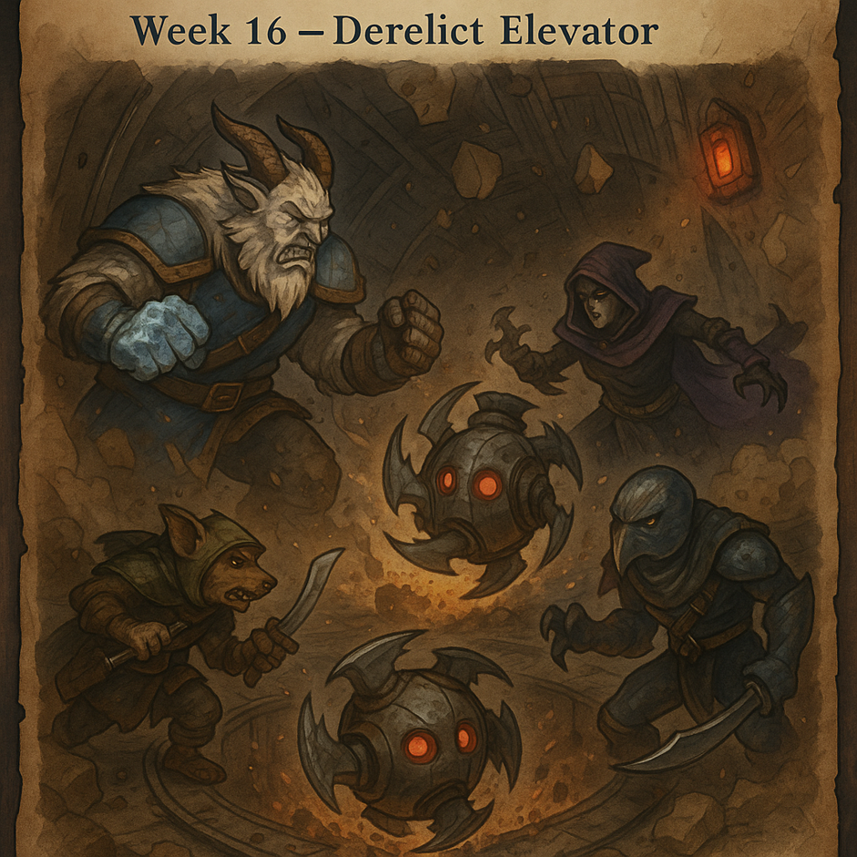

# Frosthaven Journal

_A chronicle of the adventures, misadventures, questionable decisions, and occasional heroics the Frosthaven party **Kulturministeriet**._

---

## Quick Links

- [Campaign Logbook](Logbook.md)
- [Detailed Party Roster descriptions](PartyRoster.md)

## Active Party

| Character           | Class       |
| ------------------- | ----------- |
| Poul Krebs          | Deepwraith  |
| Sha'Dow Kira        | Deathwalker |
| Unnamed Frozen Fist | Frozen Fist |
| Unnamed Trapper     | Trapper     |

## Retired Adventurers

| Character             | Class        | Legacy                                 |
| --------------------- | ------------ | -------------------------------------- |
| Necro Minaj           | Boneshaper   | Retired to help build Frosthaven       |
| Geminiels / Gemimanda | Geminate     | Remained in the Radiant Forest         |
| Britney Spear         | Banner Spear | Hero of the Coral Shard expedition     |
| Blinkenblade          | Blinkblade   | Fastest adventurer Frosthaven ever saw |

## Current Story Threads

### Coral Crown

The party continues gathering the scattered Coral Shards in hopes of restoring the ancient Lurker crown.

### Algox Civil War

The conflict between the Snowspeakers and Icespeakers remains unresolved.

### Frosthaven

The settlement continues to rebuild and expand while enduring threats from every direction.

## Recent Journal Entries

- [Week 16 - Derelict Elevator](Logbook.md#week-16-derelict-elevator)
- [Week 15 - Jagged Shoals](Logbook.md#week-15-jagged-shoals)
- [Week 14 - Frozen Fjord](Logbook.md#week-14-frozen-fjord)

