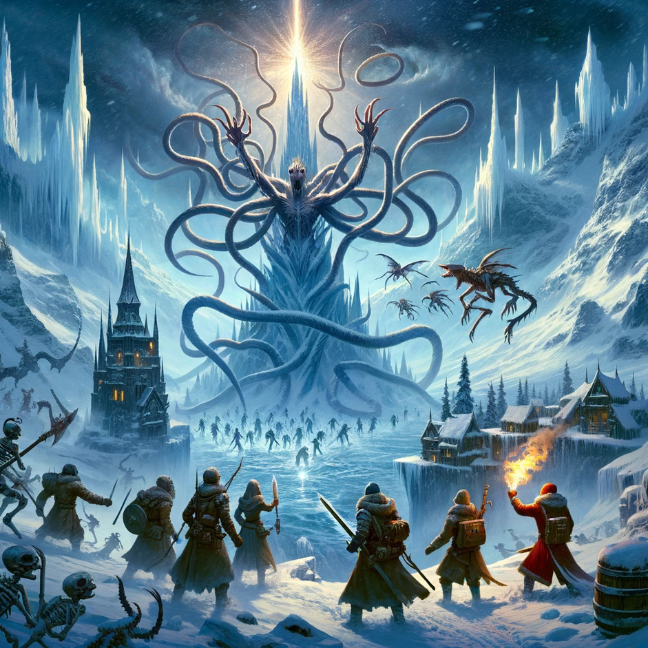

[🏠 Home](../index.md) | [📖 Logbook](../Logbook.md) | [👥 Party Roster](../PartyRoster.md)

---

# Week 10: Top of the spire

[Previous entry](week-09-upper-spire.md) | [Logbook TOC](../Logbook.md) | [Next entry](retirement-necro-minaj.md)

---

At the top of the world, surrounded by ice spikes standing guard like ancient warriors, we faced our destiny. The air crackled with the power of the demon before us, a nightmare made flesh, its twisted form a mockery of life itself.

Britney Spear stood firm, her banner catching the wind. "This monster," she declared, "will not be our downfall."

From a safe distance, Necro Minaj danced with dark energy, her spectral army swirling around her. "Let's give them a show, my darlings," she sang out, her voice light but her eyes deadly serious.

But not all were convinced of Necro's bravery. "Standing far away doesn't mean you're not brave," she snapped back, catching their looks. "Bravery comes in many forms."

As the demon tore through their defenses, Britney's banner and her faithful bird companion were destroyed. Yet, she stood taller, her voice ringing out, "We don't need banners to show our strength!"

Blinkenblade and Geminiels/Gemimanda moved as one, their attacks a dance of death. "For our home!" they cried, their blades and spells a blur.

With a final, concerted effort, the demon's shell cracked, breaking apart under the assault. It let out a sound like the world tearing, then became nothing more than a cloud of dust, leaving behind a haunting silence.

Among the debris, a piece of pink coral pulsed with an otherworldly power. "This belongs to us now," Britney said, pocketing the strange relic.

Descending the spire, the world seemed unchanged yet entirely new. The story of our battle, a testament to our courage and unwavering spirit, would resonate within Frosthaven's walls forever.

Necro Minaj's tactics, once doubted, had saved them from the worst. Britney's loss became a reminder that what they fought for was more significant than any symbol. Blinkenblade and Geminiels/Gemimanda, through their unity, showed the strength of their bond.

As the spire shrank behind them, they carried more than the coral shard; they bore a renewed sense of purpose. The wild north, with its icy spires and desolate winds, seemed less daunting. Their hearts held a light that the darkest shadow could not dim.

And so, this chapter closes, a story of unity and defiance, a beacon for all who dare to challenge the darkness. In Frosthaven's history, their names shine bright, heroes not just of battle but of the heart.