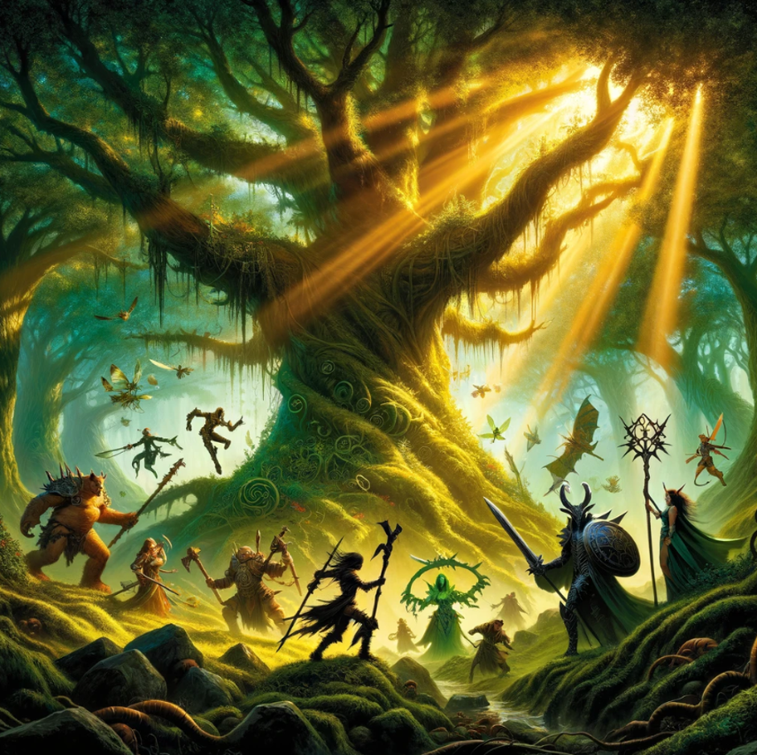

[🏠 Home](../index.md) | [📖 Logbook](../Logbook.md) | [👥 Party Roster](../PartyRoster.md)

---

# Week 11: The True Oak

[Previous entry](retirement-necro-minaj.md) | [Logbook TOC](../Logbook.md) | [Next entry](retirement-geminiels-gemimanda.md)

---

As dawn's light pierced the veil of the Radiant Forest, our resolve was tested beneath the shadow of the True Oak. Liseritus' plea, a clarion call to action, echoed in our hearts as we ventured into the verdant unknown, guided by destiny and the whispers of ancient boughs.

Sha'Dow Kira, our enigmatic ally, emerged from the shadows with a fierceness that belied her journey's infancy. With swift, shadow-laced strikes, she cleaved through the zealots, her blade singing a deadly lullaby. "Witness the strength that shadows wield," she proclaimed, earning nods of respect from her comrades.

Amid the fray, Blinkenblade, our fleet-footed Quatryl, found himself ensnared by a peculiar lethargy. His usual swift dance of death slowed to a ponderous crawl, drawing sharp words from Britney Spear, "Blinkenblade, by the Great Oak, if you don't hurry up, I'll start using you as a shield!" Her jest, laced with frustration, spurred him on, a silent vow to reclaim his swiftness echoing in his heart.

Britney Spear herself stood tall amidst the clash, her spear and shield an unyielding bastion against the tide of zealotry. Despite the absence of her spectral ally, Necro Minaj, she bore the brunt of the assault with a resilience that inspired us all. "For every fallen leaf, a new hope springs," she declared, her voice a beacon amidst the chaos.

Geminiels and Gemimanda, the harrowing essence of our swarm, wove through the battle with an elegance that blurred the lines between magic and reality. Their attacks, precise and deadly, were a testament to the enigmatic power of Harrowers. "In unity, we find strength; in diversity, power," Geminiels whispered, their voice a reminder of the intricate tapestry of life.

The climax of our confrontation came with the emergence of the Flaming Sword of Justice, a zealot ablaze with misguided fervor. It was Geminiels, in a moment of serene clarity, who extinguished this flame of fanaticism, their strike a silent ode to the harmony of opposing forces.

As silence reclaimed the glade, the zealots' fervor extinguished beneath the True Oak's ancient boughs, we found solace in the forest's whispered tales of resilience. The melody of life and death, a symphony of renewal, enveloped us in its embrace.

Returning to Frosthaven, we were met by Liseritus, his embrace a warm refuge from the storm of our journey. "The Oak? Is it safe?" he asked, his voice laden with hope. Our affirmative nod, a silent testament to our vow of secrecy, bound us to the myth of the True Oak, its existence a beacon for those who seek truth amidst the shadows.

As we shared in the simple pleasure of tea, our spirits entwined by the journey that had shaped us, our dialogue a blend of relief and contemplation.

"It seems our paths are as intertwined as the roots of the True Oak itself," mused Sha'Dow Kira, her gaze lost in the flickering shadows.

"To think, Blinkenblade nearly became my shield," Britney Spear chuckled, the memory a light jest among comrades.

"Perhaps next time, I'll lead the charge," Blinkenblade retorted with a grin, his earlier slowness now a mere shadow of the past.

And so, our tale of The True Oak, a chronicle of valor, vigilance, and veiled sanctities, wove its essence into the heart of Frosthaven, a reminder of the unbreakable bonds forged in the crucible of adventure.