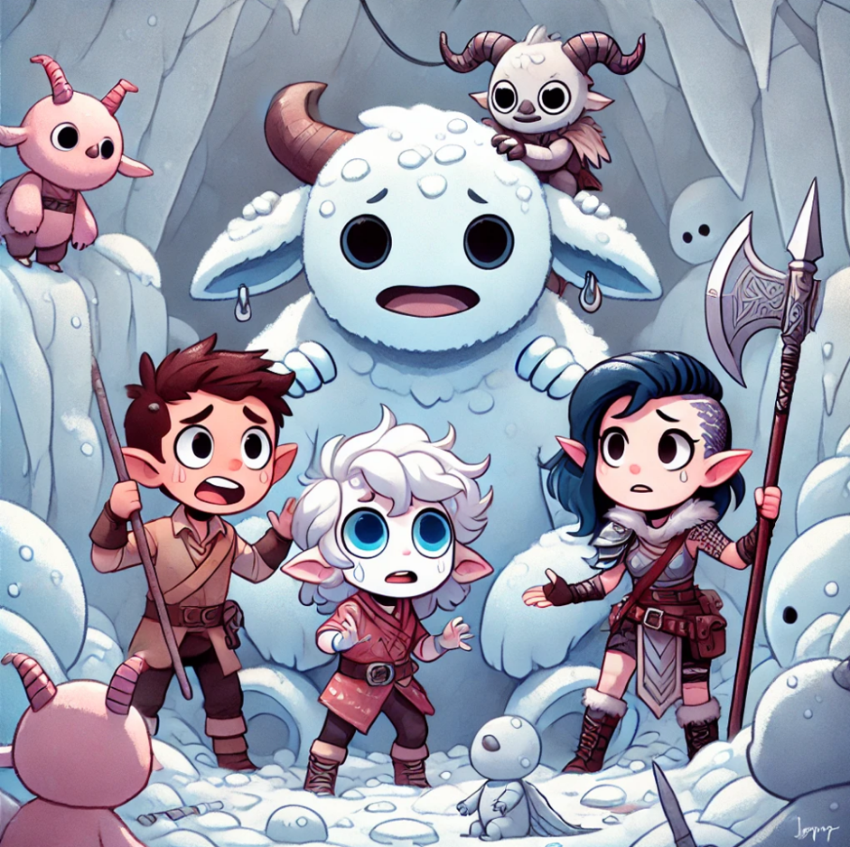

[🏠 Home](../index.md) | [📖 Logbook](../Logbook.md) | [👥 Party Roster](../PartyRoster.md)

---

# Week 13: Avalance

[Previous entry](week-12-thawed-woods.md) | [Logbook TOC](../Logbook.md) | [Next entry](week-14-day-1-snowscorn-peak.md)

---

The howl of the wind was almost enough to drive them mad. It clawed at their faces, threatened to strip the skin from their bones as they clung to the narrow trail on the mountainside. With each step, their boots slipped on the icy path, but they pressed on. There was no other choice. Frosthaven’s survival depended on them reaching the peak and dealing with the Snowspeaking wretches.

Poul Krebs, moving like a shadow in the storm, nodded to his companions. “Someone like us must keep moving. No rest until we reach the top.” His voice was barely audible over the shrieking wind. The others nodded grimly, knowing that each step brought them closer to the battle ahead, but also closer to the limits of their endurance.

Britney Spear, her banner wrapped tightly around her spear, kept a determined expression on her face. “This storm won’t stop us. We’ve fought worse, haven’t we?” She tried to keep her tone light, but the truth was she was worried. This was a different kind of fight — not against monsters, but against nature itself.

Blinkenblade, his small form almost lost in the snowdrift, glanced back. “Yeah, sure, I’d take a horde of demons over this wind any day. At least they can’t freeze your blood in your veins.” He shivered, more out of frustration than cold. “Let’s just get this over with.”

Sha’dow Kira pulled her cloak tighter, her eyes scanning the white void ahead. “Eyes up. The storm is hiding something.” Her voice was soft, but it carried a weight of command that they all felt. She had faced worse than snow and wind, and her determination was a flame that would not be extinguished.

They had barely turned a corner when the peak came into view, a distant smudge of gray and white against the swirling sky. But there was something wrong. The snow seemed to shift, to swell, like a living thing. A cold dread filled them as the realization dawned. The mountain was coming down on them.

“Run!” Britney’s voice was a whip-crack in the storm. They didn’t need to be told twice. Legs pumping, hearts pounding, they sprinted back the way they came. But it was too late. The avalanche hit them like the fist of an angry god, a white wall of death that swallowed them whole.

Blinkenblade was the first to claw his way out of the suffocating snow. His breath came in ragged gasps as he looked around. They were entombed, trapped in a dark, frozen prison. Somewhere in the distance, he heard the muffled cries of his companions.

“I’m here!” he shouted, his voice bouncing off the icy walls. He dug frantically, pushing the snow aside. His hand brushed something solid, and he pulled hard, revealing Britney Spear’s face, pale but alive.

“Thanks, Blinken,” she managed, her voice hoarse. “Now let’s get the others.”

They found Poul next, his tendrils flailing weakly. “Someone like us should really consider hibernation,” he joked, his voice trembling. Despite the situation, they laughed — a brief, hysterical sound that was more relief than humor.

Sha’dow Kira appeared from a shadow nearby, as if she had been born from the darkness itself. “No time for jokes. There are creatures here. We need to move.”

The first attack came without warning — a blur of icy claws and fangs. An ice spirit lunged at them, its form almost invisible against the snow. Britney was on it in an instant, her spear slashing through its ephemeral body. “Go back to the cold, you freak!” she spat, her voice filled with venom.

Poul and Sha’dow Kira worked in tandem, shadows and mist striking at the creatures that swarmed around them. “Keep pushing forward!” Sha’dow Kira yelled. “We have to get out of this trap!”

Blinkenblade darted through the chaos, his blades flashing. He cut down one of the spirits, his movements a blur. “Hurry! I can see a way out!” His words were barely audible over the din of battle, but they spurred the others on.

Together, they fought their way through, their determination a bright flame against the biting cold. They clawed and hacked and bled their way free, emerging into the pale light of the outside world, panting and battered but alive.

They stood, gasping for breath, on the shattered mountainside. The peak was still above them, mocking in its silent, snow-covered beauty. The path they had struggled up was now a sheer cliff, impossible to scale without the proper equipment.

“This is as far as we go for now,” Britney said, her voice tight with frustration. “We need to regroup, get better gear.”

“But we’re close,” Poul murmured, his eyes on the distant peak. “Someone like us shouldn’t give up so easily.”

Sha’dow Kira placed a hand on his shoulder. “We’re not giving up. We’re just being smart.”

Blinkenblade, who had been scouting around, pointed to a dark shape half-buried in the snow. “Looks like the avalanche uncovered something. Could be worth checking out.”

They made their way over, hearts pounding with anticipation. What they found was an old, ruined structure, jutting out of the snow like a broken bone. “A temple?” Britney wondered aloud. “What’s it doing here?”

“Doesn’t matter,” Sha’dow Kira said, her eyes gleaming with determination. “We’ll find out soon enough.”

As they stared at the structure, a sense of purpose filled them. This was not the end of their journey. The storm had thrown them off course, but it had also uncovered a new path, one that could lead them to answers they hadn’t even thought to ask.

They turned back to Frosthaven, their resolve unshaken. The mountain might have defeated them today, but they would return. They were Frosthaven’s defenders, and they would not rest until their home was safe.

Together, they began the long trek back, their minds already planning the next steps. The peak could wait, but their fight was far from over.

As the group trudged down the mountain, their breath coming out in visible puffs of steam, Blinkenblade broke the silence with a casual remark. “You know, it’s good to be a solid group of four again. It was a bit lonely up in that Spire with just three of us.”

Britney Spear, walking beside him, shot him a confused glance. “What are you talking about? There were definitely four of us in the Spire. Me, you, Necro, and Geminiels.”

Blinkenblade shook his head with exaggerated dismay. “Oh no, no, no. I’m pretty sure you weren’t there. I distinctly remember you staying behind to, I don’t know, polish your shield or something.”

Britney’s eyes narrowed as she stopped dead in her tracks. “Excuse me? _Polish my shield_? I was right there in the thick of it, fighting that prismatic demon while you were zipping around like a headless chicken.”

“A headless chicken?” Blinkenblade scoffed, planting his hands on his hips. “Please, I was moving so fast you probably didn’t even see me. But you? You must have been busy adjusting your armor or fixing your hair or something.”

Britney took a step closer, pointing a gloved finger at his chest. “I was leading the charge! If it wasn’t for me, that demon would have flattened you all. I held the line while you ran around doing... whatever it is you do.”

“Saving everyone’s necks, that’s what I was doing!” Blinkenblade shot back, his voice rising. “Maybe if you’d stopped preening for a second, you would’ve noticed!”

“Preening?” Britney almost shrieked, her face flushed with anger. “You arrogant little—listen, I _am_ the shield. I took hits for everyone, while you flitted around like a snowflake in a storm, trying to be useful!”

“Oh, I was useful all right!” Blinkenblade snapped, his small frame practically vibrating with indignation. “I took down that demon’s minions faster than you could say ‘banner duty.’ Meanwhile, you were probably busy admiring your reflection in your shield.”

“You know what, Blinken?” Britney crossed her arms, her eyes blazing. “Maybe next time, I’ll just let you handle the big bad all by yourself and see how far your _flitting_ gets you.”

“Maybe you should!” Blinkenblade shot back, his voice a pitch higher. “And while you’re at it, try not to chip a nail. Wouldn’t want you to get hurt before the real fight.”

“Oh, I’ll show you real fighting, you little—” Britney stepped forward, her spear clutched tightly in her hand.

“Hey, hey, easy there!” Sha’dow Kira interjected, slipping between them with a bemused smile. “Save some of that energy for the next battle, will you?”

Poul Krebs, watching the whole exchange with an amused expression, chuckled. “Someone like us thinks you both need a nap. We’re all in this together, remember?”

Britney and Blinkenblade glared at each other, then looked away, their cheeks still flushed with lingering anger.

“Fine,” Britney muttered. “But next time, you’re not getting away with that ‘polishing my shield’ nonsense.”

“Fine by me,” Blinkenblade shot back. “As long as you remember who saved the day.”

With that, they continued down the mountain, their bickering now more subdued, the storm of their argument dissipating as quickly as it had come. But even as they walked in silence, there was a small, begrudging smile tugging at the corners of their lips.

Maybe, just maybe, they were a good team after all.