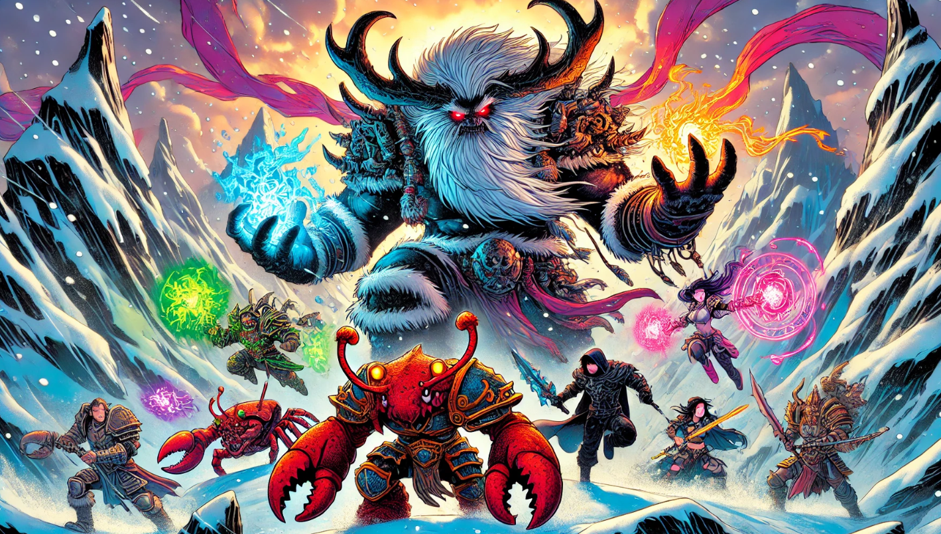

[🏠 Home](../index.md) | [📖 Logbook](../Logbook.md) | [👥 Party Roster](../PartyRoster.md)

---

# Week 14 – Day 1: Snowscorn Peak

[Previous entry](week-13-avalance.md) | [Logbook TOC](../Logbook.md) | [Next entry](week-14-day-2-skyhall.md)

---

The wind howled with relentless fury, biting at our faces as we made our ascent. Each step toward Snowscorn Peak felt like a battle against the elements. Blinkenblade muttered curses under his breath, his small form darting ahead like a winter wraith, while Sha’dow Kira, ever cynical, was not far behind, her short legs struggling to keep pace, though her shadows moved with unsettling grace.

"I don't know why we keep doing this!" she snarled, more to herself than anyone else.

But up we climbed, one frozen rock at a time, until finally, our fingers brushed snow instead of ice. We hauled ourselves onto the summit to find an ancient Algox, flanked by demons, waiting.

"Our preparations are nearly complete," she sneered, as if daring us to try and stop her.

Well, challenge accepted.

"Can't this wind die down already? My hair is in disarray!" Britney Spear grumbled, tightening her grip on her weapon, though her eyes gleamed with anticipation. Poul Krebs, always silent, gave a nod, his strange Lurker eyes fixed on the enemy with unwavering focus.

We split into two groups, a silent agreement between us. Blinkenblade and Sha’dow Kira took the right flank, Britney Spear and Poul Krebs the left.

The demons were quicker than expected, but Blinkenblade was quicker still. He zipped past the fiends like lightning, leaving Sha’dow Kira alone to face their fury.

"Typical," she muttered, raising her shadows to strike. The demons snarled, closing in, but she was unflinching. "Blinkenblade, next time I'll make sure the shadows cling to you like glue," she called after him, a smirk playing at her lips despite the danger.

Her shadows worked their deadly magic, but it was a slow, grueling process.

On the left, Britney Spear wasted no time. "For Frosthaven!" she cried, her spear flashing in the wind as she cut down one of the demons with a swift, clean strike. Poul Krebs, despite his usually stealthy demeanor, followed suit, striking from the shadows with eerie precision.

But the battle wore on, and as the demons clawed and bit, Britney summoned her healing banner, planting it firmly in the snow. "A little help, anyone?" she called, gritting her teeth through the pain. Both Poul and Sha’dow Kira would later admit how much they relied on that banner’s radiant energy to keep them fighting.

The wind howled louder, as if the mountain itself was angry.

Blinkenblade, Britney, and Poul converged on the Elder Algox at the peak. The ground trembled beneath our feet, but we pressed on. Poul darted from shadow to shadow, while Britney’s spear clanged against the Algox’s steel armor.

"I’ll take her down!" Blinkenblade cried, leaping in for a vicious strike. Britney Spear laughed aloud, landing her own hit just after him. Poul, ever silent, struck from behind, but the Algox’s defenses finally crumbled under the weight of all our attacks.

As the Algox elder crumbled into the snow, her final words echoed ominously in the thin air. "The mountain... it falls."

For a moment, we stood there, unsure if her warning was mere bravado or something worse. But then, the ground beneath us shifted. The mountain groaned, as if it were alive, and we knew that Snowscorn Peak would not stand much longer.