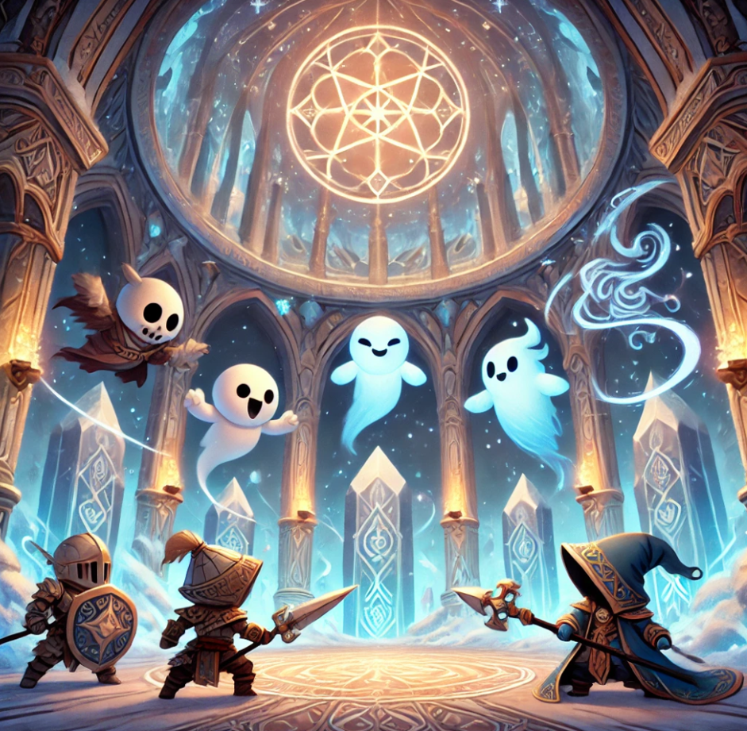

[🏠 Home](../index.md) | [📖 Logbook](../Logbook.md) | [👥 Party Roster](../PartyRoster.md)

---

# Week 14 – Day 2: Skyhall

[Previous entry](week-14-day-1-snowscorn-peak.md) | [Logbook TOC](../Logbook.md) | [Next entry](week-15-sunless-trench.md)

---

The world was collapsing around us. Snow and rock roared past as the very bones of Snowscorn Peak trembled. The rappel lines burned against our gloves as we slid down, dodging boulders that crashed into the depths below. The moment our boots hit the ground, we unlatched the harnesses and ran—not away, but into the mountain’s tunnels, where the last hope for stopping this disaster might lie.

Panicked Algox filled the passageways, their massive forms jostling past us in a frenzied exodus. But our goal was ahead, standing firm against the tide—Chief Elland, bellowing commands to his kin. His white-furred bulk was rigid with determination, even as the ceiling threatened to collapse.

“The spirits of Skyhall have turned against us,” he growled as his sharp eyes met ours. “You must come with me, quickly!”

He led us deeper into the mountain, into a grand chamber unlike anything we'd seen before. The Skyhall—a vast, circular sanctum, domed in shimmering crystal and lined with intricate glyphs carved into the stone. Towering ice pedestals stood in perfect symmetry, casting pale reflections across the polished floor. It had the air of something ancient, sacred, a place meant for peace. But there was no peace here.

The very air hated us.

The shadows thickened, twisted, breathed. Gray spirits slithered into being, writhing free from the nothingness, their pale, hollow faces contorted in rage. The air filled with an agonized, whispering shriek, and then they attacked.

The Battle for Skyhall

Britney Spear stood at the vanguard, bracing her shield as the first wave of wraiths descended. "Alright, ghosties," she called, leveling her spear. "Let’s dance!"

Her banner flared with light as she drove it into the ground, an anchor amidst the chaos. Sha’dow Kira, ever watchful, darted between the swirling spirits, her twin daggers coated in void energy. "You sure this place was built for the living?" she murmured, sending shadows spiraling outward. "Because it’s feeling awfully undead in here."

Blinkenblade was already a blur, weaving between spirits and striking in quick, precise bursts. "Don’t worry, Kira," he quipped. "They’ll be extra dead soon." His daggers flashed, carving through the spectral forms before they could react.

Meanwhile, Poul Krebs moved differently—like water, like mist. His lurker frame dissolved into the gloom, tendrils of the deep swirling around him. When he struck, it was like a hunter’s net closing—silent, unseen, deadly. "Someone like us," he murmured, "knows how to deal with things from the dark."

But the spirits were endless. No matter how many we cut down, more rose in their place, more furious, more relentless.

“Something is wrong,” the chief huffed, his voice tight with strain. “No Snowspeaker could control so many spirits. There must be something here that spurs their anger.” He turned his gaze skyward and roared, "Show me what is wrong, spirits! Tell me what I must do!"

The answer was violent.

A tremor split the air. The ground lurched, nearly knocking us from our feet. Then—with a sound like the earth itself breaking—a massive icicle plummeted from the ceiling, shattering a pedestal in a blast of frost.

Beneath it, something pulsed.

A black crystal, jagged and gleaming with malevolent energy, thrust upward from the shattered plinth. It was wrong, a corruption that seemed to drink the very air around it.

“There!” Elland bellowed. “They have corrupted Skyhall itself. We must purge their devilry. Destroy the pillars!”

Breaking the Curse

Britney and Blinkenblade sprinted toward the nearest pedestal. "I’ll break it, you cover me!" Britney called.

"Cover you? Please," Blinkenblade smirked. "I’ll break it first."

He blurred forward, striking the ice with precision, but the dark energy resisted. Britney, not one to be outdone, swung her spear in a wide arc—CRACK!—and sent fractures spiderwebbing through the corruption.

"Point for me," she grinned.

Sha’dow Kira moved in tandem with Poul Krebs, dismantling another of the dark plinths. Kira’s shadows wrapped around it, choking the malevolence from within. Poul struck next, his blade sinking deep into the corruption. The pedestal shattered, and the spirits above it howled in agony before vanishing into smoke.

One by one, we struck them down, each explosion of ice sending shockwaves through the chamber. The spirits screamed as their tether to the world was severed, their forms twisting before vanishing into the void.

And then, just as suddenly as it had begun: Silence.

The mountain stilled. The whispers stopped. The spirits were gone.

We stood amidst the ruins of Skyhall, gasping for breath, the shattered remains of the corruption at our feet.

The Aftermath

Chief Elland surveyed the devastation with dark, weary eyes. He exhaled, steam rising from his fur in the cold air.

“This… this cannot continue,” he said, his voice heavy with sorrow. "Look at what’s befallen Skyhall. Such sacrilege. Such hatred." His eyes sought something beyond the broken walls, beyond the cracks in the earth. "The Snowspeakers must be destroyed."

The voice came from behind us.

We turned to see a new Algox, an older female, flanked by battle-worn warriors. She stepped forward, her expression hard as chiseled ice.

“The only solution,” she said, “is to wipe them out completely. We can use the conduits our kin have erected around the Whitefire Wood to purge them from the land.”

Elland’s jaw tightened, his fists clenching. "No, Putargal. For three centuries, we have made war with the Snowspeakers, and look where it has brought us. If not for the warm-bloods, our home would be rubble. More conflict is not the answer. Water poured on ice will only create more ice."

Putargal’s eyes burned with contempt. “Do not presume to speak for us all, Elland.” Her voice was low, seething. "The Snowspeakers kill us. Corrupt the Skyhall itself. They threaten to destroy everything we know... and you call for peace?"

She turned her glare to us. "You, warm-bloods. Come meet with me after you have recovered. We will honor our alliance only if you aid us in our counterattack.” She turned on her heel and strode away, her warriors falling in line behind her.

A deep silence settled over the chamber.

Elland turned to us, his face solemn. “Please,” he said, his voice quieter now. “This is not the way. More fighting will never bring us peace. You must join me instead.” He hesitated, then took a step closer. “I have a plan to end this brutal cycle.”

The weight of his words settled over us. One path led to war. The other—to something far more uncertain. The mountain stood in ruins. And we, caught between two tides, had to decide which way to turn.