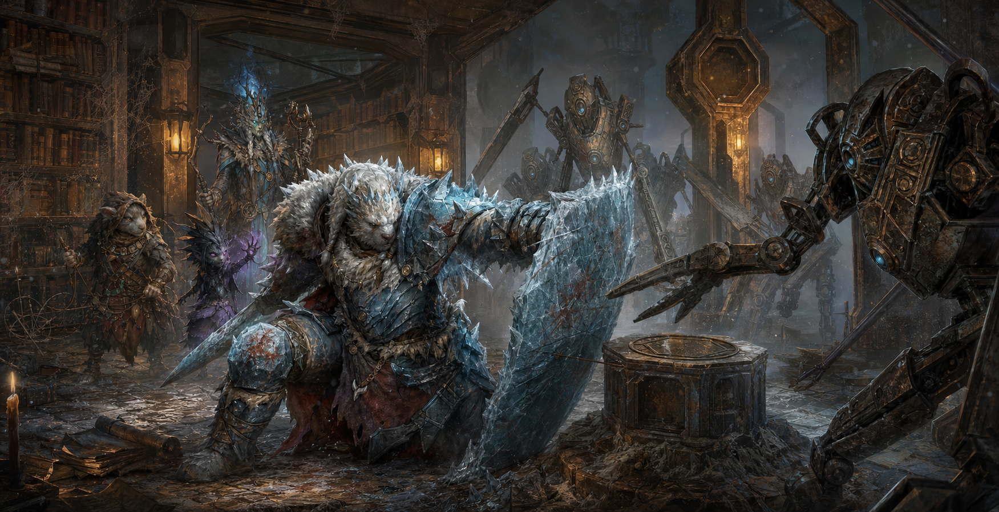

[🏠 Home](../index.md) | [📖 Logbook](../Logbook.md) | [👥 Party Roster](../PartyRoster.md)

---

# Week 17 - Quatryl Library

[Previous entry](week-16-derelict-elevator.md) | [Logbook TOC](../Logbook.md) | [Next entry](../Logbook.md)

---

Scenario 26: Quatryl Library  
Date played: 2 June 2025  
Characters present: Trapper, The Creator; XL-sa; Sha'Dow Kira. Poul Krebs was absent, probably trapped under stage lights somewhere, explaining sorrow to an audience that had only asked for one song.

After the elevator's descent, we chose the quiet path.

In hindsight, this was optimistic.

The left passage carried us across a steel walkway and into a tunnel braced by rusted hexagonal beams, all old Quatryl craft and bad intentions. The air tasted of dust, iron, and the sort of silence that keeps its own records. For a while, nothing moved. No claws. No voices. No polite warning from the walls.

"Left is still," XL-sa reminded us.

Sha'Dow Kira looked up into the dark. "Still is not the same as safe."

At the end of the passage we found the library.

It should have been beautiful. A great rectangular room, shelves sagging beneath brittle old books, tables sleeping under dust, chairs arranged as if some long-dead scholars had stepped away for a meal and never returned. In the center stood a stone pedestal capped with a steel pressure plate, which immediately made Trapper, The Creator whisper, "Oh, that is either a trap or an invitation to build a better one."

Then the machines arrived.

They came from the far side of the library in hard, hurried lines: ruined security constructs with metal feet, fixed purpose, and absolutely no respect for reading hours. Worse, they were not only coming for us. Most of them were rushing the pressure plate, and none of us wanted to learn what happened if they reached it.

XL-sa moved first.

He planted himself between the machines and the rest of us, ice crawling over his fists and shoulders until he looked less like an adventurer and more like a piece of the glacier that had learned stubbornness. The robots hit him like falling anvils. Blades sparked against frost. Metal limbs crashed into his guard. Again and again he absorbed the impact, each blow buying the rest of us one more breath.

"The plate must remain empty," he said.

"That is your tactical assessment?" Sha'Dow Kira snapped, shadows gathering around her hands.

XL-sa lowered his head as another machine slammed into him. "The ice agrees."

That was enough.

With XL-sa holding the center, Sha'Dow Kira turned the library's shadows against its guardians. Darkness spilled between tables and under chairs, tripping the machines' focus just long enough for her blades and magic to find the gaps. She fought with her usual grace, which is to say she looked personally offended that the enemy existed.

Trapper, The Creator worked the edges of the room, muttering at high speed while turning discarded chair legs, snapped wire, book straps, and one probably priceless bookmark into a network of inconvenient surprises. One construct lurched toward the pressure plate, only to have its leg caught, its balance ruined, and its face introduced to the floor with scholarly finality.

"Gotcha," Trapper whispered, then frowned. "No, wait. That one needs more theatrical collapse."

There was no time to improve it. More machines poured in.

The pile of broken parts grew around the pedestal. Every time the room seemed close to stillness, another wave dragged itself from behind the shelves, spindly and persistent and very clearly not finished with us. XL-sa's breathing grew heavier. Frost cracked along his armor. The library floor beneath him was dark with oil, melted ice, and blood.

"Fall back," Sha'Dow Kira called.

He did not.

Instead, XL-sa stepped farther forward.

For one bright, terrible stretch of battle, he became the wall. The machines crashed against him and stopped. Sha'Dow Kira struck from his shadow. Trapper's snares snapped shut around anything that tried to slip past. The pressure plate stayed clear. The library remained, technically, a library, though no librarian in any age would have approved of the noise.

At last, one final machine drove through the frost and struck XL-sa hard enough to bring him to one knee. He answered with a blow that caved its chassis inward, then another, slower, that sent it skidding into a shelf in a rain of dust and paper.

Then he fell.

Not dead. Not beaten in spirit. Just spent beyond what even the ice could lend him.

Sha'Dow Kira finished the last construct with a sharp motion and a sharper look. Trapper, The Creator stood very still beside the pressure plate, one paw hovering over a half-assembled emergency contraption.

"Do not," Sha'Dow Kira said.

"I was only going to check if it was still dangerous."

"With a spoon?"

"A calibrated spoon."

The room returned to silence.

And because it was a library, the silence felt correct.

Once XL-sa was breathing steadily again, we searched the shelves. Most of the books were brittle, but not useless. One oversized volume held maps of the complex, showing paths from the library toward a vast central core and, deeper within it, a smaller chamber marked by a word that seemed close to "thought." Another ruined book would have been easy to dismiss, if not for the voice that interrupted us.

A ragged Quatryl emerged from the far door, chained, tired, and somehow still academic enough to sound mildly offended by our browsing technique. His name was Crain Tallengyr, and he had been trapped below for a year after choosing, quite unwisely, to explore alone.

The machines, he told us, called themselves the Unfettered.

Poul would have hated that. Too dramatic. Too much like a band name.

Crain believed they had once been made for labor, but whatever purpose bound them had broken long ago. Now they were organized. Planning. Gathering strength beneath the ice while Frosthaven went on believing the danger was somewhere else.

There was no real debate after that. If these machines meant to rise against the land above, then Kulturministeriet would have to go deeper still.

Crain offered to guide us toward the central chamber, then promptly collapsed from exhaustion, which felt fair. We brought him back with us, along with the maps, the warning, and XL-sa, who woke once on the return journey just long enough to press one hand to the frozen ground.

"The silence has teeth," he murmured.

Trapper, The Creator nodded solemnly. "Good. Teeth can be trapped."

Sha'Dow Kira sighed. "I miss Poul already."

So ends the quiet path.

It was not safe.

But it did lead somewhere important.