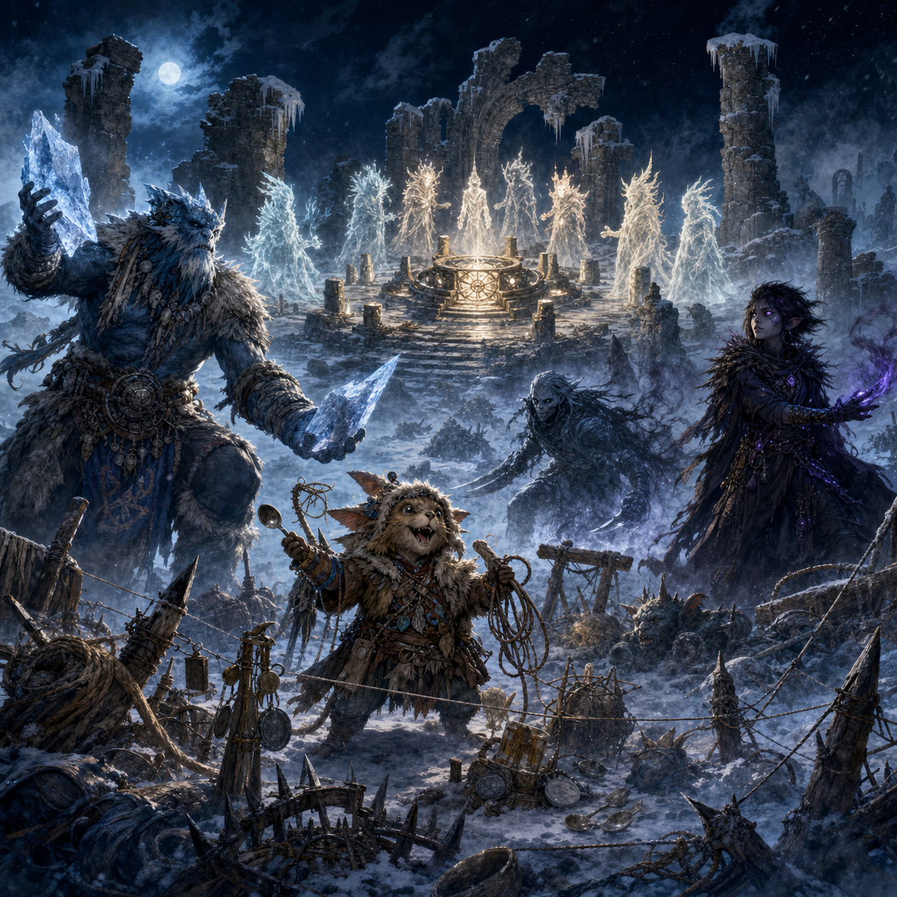

[Home](../index.md) | [Logbook](../Logbook.md) | [Party Roster](../PartyRoster.md)

---

# Week 18 - A Strong Foundation

[Previous entry](week-17-quatryl-library.md) | [Logbook TOC](../Logbook.md) | [Next entry](../Logbook.md)

---

Scenario 65: A Strong Foundation  
Date played: 20 June 2026  
Characters present: Trapper, The Creator; XL-sa; Sha'Dow Kira; Poul Krebs.

Frosthaven's alarm bell rang through the freshly fallen night snow, which is never a polite sound and rarely a misunderstood one.

At the gate, we found eight unfamiliar figures approaching through the dark. They moved without footprints. Their forms shimmered at the edges. When they spoke, their mouths moved together and a single voice arrived inside our thoughts.

Aesthers.

They called themselves Voice-of-Eight, and they had come asking for help. Once, they had been separate. After the calamity that scattered their kind, they had found one another in the emptiness and bound themselves together tightly enough to return. It sounded beautiful in the way that frost on a grave marker can be beautiful.

"So they are a choir," Poul Krebs whispered.

Sha'Dow Kira gave him a look. "Do not sing at the ghosts."

"I was not going to sing at them," Poul said, already looking wounded.

Voice-of-Eight needed an old elemental array north of Frosthaven. If restored, it could anchor them more firmly to this plane. If left alone, it would remain buried in ice, fog, and whatever hateful things had gathered around it. Naturally, Kulturministeriet agreed to investigate, because this is how all good municipal decisions begin: at night, in the snow, with a telepathic committee.

The fog thickened as we followed them north. The air felt frozen in place, as though winter itself had paused to listen. Ruined stone rose at the edge of sight, half-buried and half-remembered. Then came the cackling.

Small cruel creatures danced through the mist, throwing stones at hulking undead things that were too dead to be properly irritated. The moment we appeared, everyone involved decided we were more interesting.

Trapper, The Creator took one look at the broken walls, scattered rubble, and narrow approaches, and began vibrating with professional joy.

"Oh," they breathed. "This place understands me."

"This place is a ruin," Sha'Dow Kira said.

"Exactly."

The battlefield quickly became less of a battlefield and more of a highly opinionated construction site. Trapper dragged obstacles into place, threaded snares between stones, stacked barriers where allies very clearly wished barriers were not being stacked, and made the sort of satisfied clicking noises that suggest a Vermling is either inventing something clever or about to be banned from another public building.

Poul stepped forward, found a gap in the enemy line, and vanished.

"Poul?" XL-sa asked.

No answer.

"He is doing the thing again," Sha'Dow Kira said.

Behind the enemy line, something screamed. Then something else screamed. Then Poul's voice drifted out of the fog, cheerful and slightly breathless: "No one can see me when I am dancing in the dark."

"That is not how dancing works," Sha'Dow Kira called.

"It is how mine works."

While Poul became less a party member and more a rumor with knives, XL-sa planted himself among the dead and the cackling things. The ice around him cracked outward in hard white veins. Then, to everyone's surprise, he did not simply punch the nearest problem into the snow. He lifted one arm and hurled a shard of ice through the fog.

It struck with a sharp report.

Trapper paused mid-knot. "You can do that?"

XL-sa considered the question with grave seriousness. "The ice can go where I cannot."

"That is extremely inconvenient information to receive this late," Poul said from nowhere in particular.

Sha'Dow Kira had more immediate concerns. Darkness pooled around her feet, then peeled away into sharp-edged shadows that slipped through the fog and struck where the enemy was thinnest. She stayed behind the worst of the violence, letting others create the noise while she collected the endings. Every now and then, she darted forward to gather whatever the battlefield had kindly left unattended.

"Scraps," she said, when Trapper noticed.

"Strategic scraps?"

"Mine."

The ruins did not give way easily. Something in the place tugged at the mind, trying to pull anger up like a hook under the ribs. Perhaps that was why the creatures had gathered there. Perhaps the array had been leaking old elemental malice into the snow for years. Or perhaps Frosthaven had simply trained us to expect every abandoned structure to be rude.

Whatever the cause, we held.

Trapper's obstacles turned direct paths into embarrassing suggestions. XL-sa endured the press, then answered at range with more ice than anyone had budgeted for. Sha'Dow Kira and Poul argued, repeatedly, over who had first claim on the dark element, which is a niche disagreement until you have heard it happen during a battle with undead.

"I need it," Sha'Dow Kira snapped.

"I am behind enemy lines," Poul protested. "Emotionally, spiritually, and tactically."

"That is not a claim."

"It is at least two claims."

The last wraith finally came apart in the frozen air. With it gone, the other creatures scattered into the fog, suddenly remembering urgent appointments elsewhere. Silence settled over the ruin.

Then Voice-of-Eight appeared before the elemental array.

They took their places around the ancient device and began to chant. Eight voices, separate now, braided through the cold in a sound both eerie and lovely. Ice melted from the array. One of the Aesthers stepped forward and dissolved into mist, flowing into the contraption until it glowed from within.

For a few minutes, no one joked.

Even Trapper stopped adjusting the tripwire that absolutely did not need adjustment.

When the Aesther reformed, Voice-of-Eight told us the truth of the place. The anchor remained, but the elemental cores were gone. At least four would need to be found and restored before the array could become more than a memory.

They would search the planes for a way to retrieve them. They would return in six weeks.

Poul, who had reappeared with snow in his collar and someone else's coin purse in his hand, nodded solemnly. "Then we wait for the choir to find its instruments."

Sha'Dow Kira looked at him. "That was almost good."

"Almost is where art lives."

On the way back to Frosthaven, Trapper walked at the rear, glancing sadly over their shoulder at the ruined battlefield.

"I could have improved it," they muttered.

"You made it nearly impassable," Sha'Dow Kira said.

"Nearly."

XL-sa lifted a small shard of ice and listened to it as the town lights came into view.

"The foundation remembers," he said.

No one knew what that meant.

But north of Frosthaven, something ancient had begun to wake. Voice-of-Eight would return. Four elemental cores waited somewhere beyond our reach. And Kulturministeriet, through trap, shadow, frost, and one invisible Lurker apparently auditioning for a solo career, had once again agreed to become involved in matters far older than common sense.
